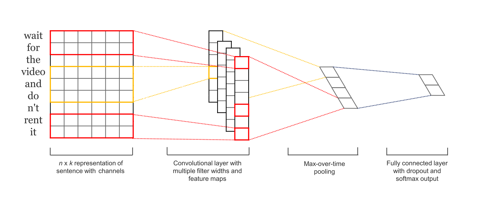

# NLP каскад. Разметка текста по образцу или Классификация (Label Propagation)

  

> Модуль решает задачу `semi supervised разметки` - на основе частично размеченного датасета модель пытается разметить остальные образцы. Работает для текстовых данных.

`````{admonition} Идея для анализа бизнес-процесса
:class: tip
Текстовые атрибуты лога могут быть богаты на инсайты. Однако обычно они представлены в свободной форме и их обработка вручную затруднена. Часто владелец процесса понимает, на основе каких критериев группируются текстовые атрибуты - например, по месту возникновения проблемы или по исполнителю, по негативной или позитивной обратной связи клиента, либо как-то иначе. Размечать все данные может быть дорого и монотонно, а значит - субъективно. Идея заключается в том, чтобы предоставить модели достоверные образцы для каждой из ожидаемых групп текстов для того, чтобы по образу и подобию она разметила остальные. 

`````

В рамках библиотеки данная модель реализована как модуль `sberpm.nlp.label_propagation`.

## Формализация задачи для анализа процессов

Работаем с логом автоматизированной системы, в которой фиксируются обращения пользователя по шаблонам. Предположим, что 60% пользователей могут идентифицировать проблему явно и выбирают корректный шаблон, а 40% сомневаются и выбирают вид шаблона "Другая проблема". Мы уверены, что виды шаблонов на 100% покрывают существующие проблемы, поэтому хотим определить правильную категорию каждому обращению, которое попало в шаблон "Другая проблема". В таком случае, при применении алгоритма на текстовый атрибут лога, получаем новый атрибут вида "Группа текстовых комментариев".

## Алгоритм в основе модуля

Подход используется в случаях, когда группировка текста необходима строго по экспертной оценке принадлежности к группе от пользователя, другими словами, решается задача классификации (или обучение с учителем).

```{admonition} Теоретическая справка
:class: dropdown, tip

**Классификация (обучение с учителем)** - задача отнесения объекта по совокупности его характеристик к одному из заранее известных классов.

```

### Технический ландшафт

Решение реализовано в два шага:
1. Получение векторного представления текстовых комментариев (те образцы, которые размечены как представители известных групп);
2. Адаптация модели под доменную область на этих образцах (англ. domain adoption) - иными словами, дообучение модели на конкретном контексте, чтобы она могла лучше разделять группы на основе эталонов-образцов;
3. Получение векторного представления для неразмеченной части текста и запуск процедуры предсказания (разметки) на предложенные группы.

Шаги 2 и 3 представляют собой архитектуру сверточной нейронной сети, на вход которой подается текст, внутри нее происходит получение векторного представления, дообучаемого на шаге 2, а на выходе - предсказание известной группы на основе вероятности принадлежности нового неизвестного текста к известным образцам (шаг 3).



Для векторизации был выбран подход [BPEmb](https://bpemb.h-its.org/).

```{admonition} Теоретическая справка
:class: dropdown, tip

Идея похожа на [коды Хаффмана](https://dl.acm.org/citation.cfm?id=177910.177914). Изначально единица языка - это символ, а словарь - последовательность символов. Шаг за шагом символы попарно объединяются, если встречаются вместе чаще других, и так постепенно пополняется словарь. Разновидности этой токенизации использовались как в GPT2, так и в моделях BERT, RoBERTa. Этот подход позволяет решить проблемы отсутствующих в словаре слов, которые мы не можем закодировать, поскольку слово теперь можно представить по известным частям. 

Далее каждой попавшей в словарь последовательности присваивается вектор, и именно он используется в качестве входных данных для нейронных моделей при обработке естественного языка.

```

В дальнейших реализациях будут добавлены и другие способы векторизации текста, например, используемые в генеративных моделях (GenAI).

### Модификация параметров алгоритма

``` {list-table} Параметры модели
:header-rows: 1

*   - Параметр
    - Пояснение к параметру 
      
*   - {bdg-dark-line}`Название текстовой колонки`
    - Название колонки с текстовыми данными.  

*   - {bdg-dark-line}`Название колонки с разметкой`
    - Название колонки с размеченными группами.

*   - {bdg-primary-line}`Флаг неразмеченных образцов`
    - Указание на значение в колонке с разметкой, которым отмечены строки, подлежащие маркировке моделью, например "Разметить" или "Другое".

*   - {bdg-primary-line}`Путь к модели`
    - Локальный путь к сериализованной модели. На текущий момент возможно передать путь только для модели класса BPEmb (рекомендуем к использованию ru.wiki.bpe.vs100000.model).
      
*   - {bdg-dark-line}`Путь к токенизатору`
    - Локальный путь к токенизатору. На текущий момент возможно передать путь только для модели класса BPEmb (рекомендуем к использованию ru.wiki.bpe.vs100000.d300.w2v.bin).

*   - {bdg-dark-line}`Размерность`
    - Размерность вектора для текста. Указывается в соответствие с выбранной моделью. Для рекомендованной на текущий момент составляет 300.

*   - {bdg-dark-line}`Размер словаря`
    - Количество токенов, с которыми работает модель. Указывается в соответствие с выбранной моделью. Для рекомендованной на текущий момент составляет 100 000.

*   - {bdg-dark-line}`Тип токенизатора`
    - Два вида токенизаторов - sentence_piece и context_embeddings.
    Токенизатор sentence_piece целесообразно применять, если корпус текстов содержит повторяющиеся фразы, включая аббревиатуры и особые термины. В то время как токенизатор context_embeddings предназначен для работы с текстами в стиле повествования, значит, может работать с синонимами и т.д.
    На текущий момент возможно выбрать только sentence_piece, в следующих версиях библиотеки будет добавлена возможность использования контекстных языковых моделей.

*   - {bdg-primary-line}`Размер батча`
    - Количество текстов, которые используются в одной эпохе обучения в процессе адаптации модели под домен. Если текстов достаточно, значение параметра можно не изменять, иначе - понизить.
      
*   - {bdg-dark-line}`Доля текстов для подсчета длины образца`
    - Параметр для указания того, какая доля текстов будет участвовать в расчете типовой длины образца текстов. Необходимо для того, чтобы унифицировать слишком длинные образцы и очень короткие. 

*   - {bdg-dark-line}`Количество эпох`
    - Количество итераций адаптации языковой модели под домен. Адаптация (иначе - дообучение) необходимо для того, чтобы модель адаптировала свои знания под текстовый датасет и токены, которые она раньше "не видела". При малом количестве размеченных текстов не рекомендуется увеличивать параметр.
```

### Краевые случаи и ограничения

Важно, чтобы модель научилась различать группы текстов, то есть необходимо, чтобы она увидела достаточное количество образцов для идентификации закономерностей и особенностей каждой из групп. Необходимо иметь в виду следующее:
1. Уникальных примеров текстов на каждую группу должно быть не менее 3 (учимся, проверяем, считаем общую метрику на валидации), но крайне рекомендуется больше.
2. Рекомендуемое количество размеченных примеров - 30-40% датасета.
3. Не обязательно размечать одинаковое количество текстов каждой группы, но допускать сильный дисбаланс групп не желательно (модель будет склонна предсказывать более частую группу, так как математически шанс ответить "правильно" выше).


``` {list-table} 
:header-rows: 1

*   - **Параметр**
    - **Проблема**
    - **Возможное Решение**
   
*   - {bdg-light-line}**Доля текстов для подсчета средней длины образца**``
    - Мало образцов текста для класса
    - Это количество текстов из выборки, на основе которых будет определяться типовая длина предложения (а точнее - количество токенов в нем, при этом токен != слово). По дефолту, при расчете типовой длины исключается 5% самых длинных предложений, а максимальное значение из оставшихся и является типовой длиной. Затем 5% предложений, которые исключались при расчете, сокращаются справа до типовой длины. Бывает так, что тексты начинаются одинаково, и при условии удаления 5% токенов сверх установленной длины вновь появляются дубликаты текстов, а иногда даже тексты, размеченные разными группами. Рекомендуется удалять одинаковые части текста в начале, если они известны. Другой вариант обхода этого исключения - выставить порог 1.0 и взять 100% текстов для подсчета длины, в таком случае типовым образцом будет считаться самый длинный в выборке. Более предпочтительным считаем первое предложенное решение.

```
